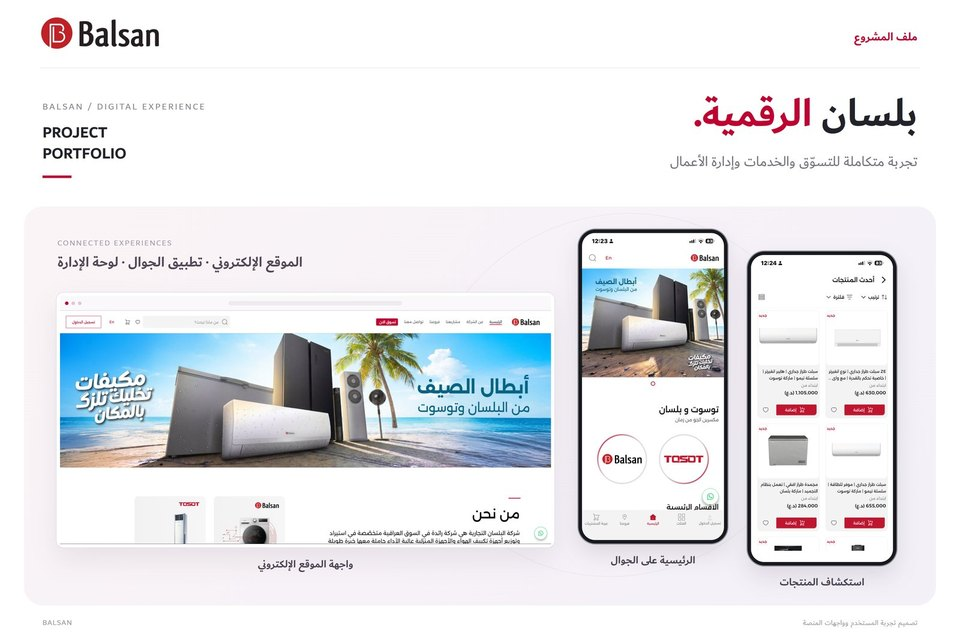
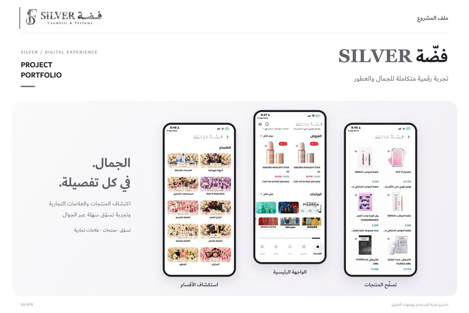
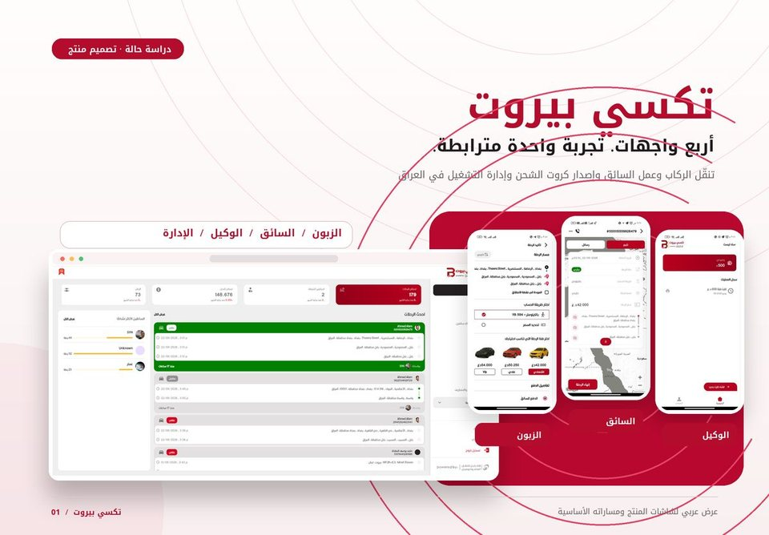
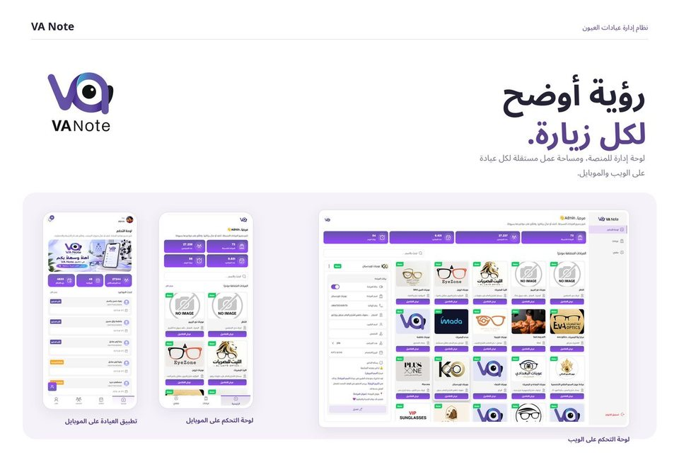
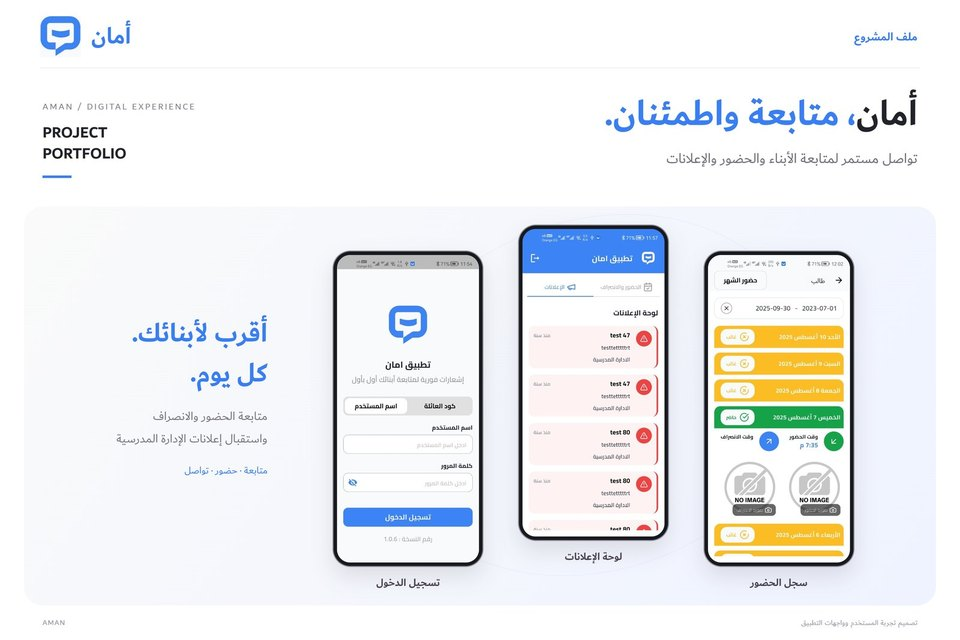
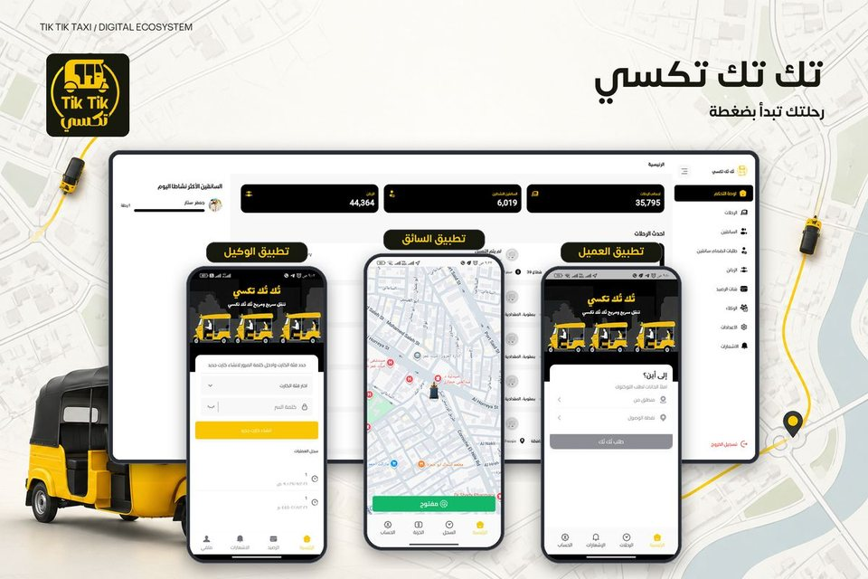
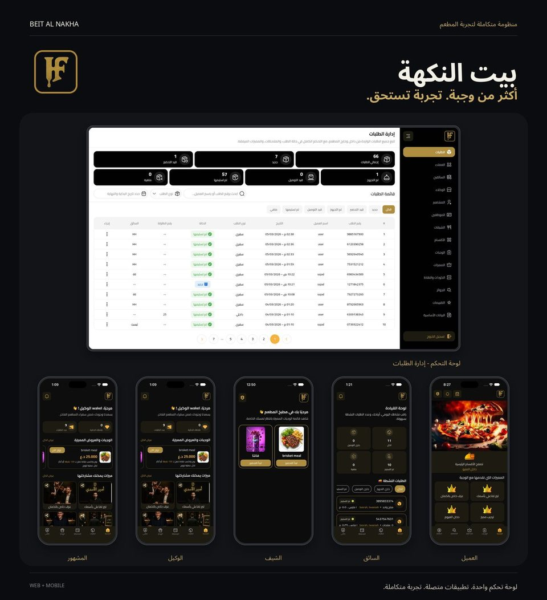

<div align="center">


[+%F0%9F%93%A6;5%2B+Hours%2FWeek+Saved+via+CI%2FCD+Pipelines+%E2%9A%99%EF%B8%8F)](https://git.io/typing-svg)

<p align="center">
  <a href="https://ahmed-portfolio-six-lovat.vercel.app/"></a>
  <a href="https://linkedin.com/in/ahmedmohamedalam"></a>
  <a href="mailto:ahmedalam4887482@gmail.com"></a>
  <a href="https://wa.me/201559555092"></a>
  <a href="https://pub.dev/publishers/ahmedalam782/packages"></a>
</p>

</div>

---

## ⚡ Quick Pitch & Bio

> 🌐 **Live Website**: [ahmed-portfolio-six-lovat.vercel.app](https://ahmed-portfolio-six-lovat.vercel.app/)  
> 👋 **Hi, I'm Ahmed Mohamed Osman (Ahmed Alam)** — a **Flutter Developer** with **2+ years of production experience** shipping **7+ cross-platform mobile apps** on Google Play and the Apple App Store. Creator of **`adaptive_video_player`** (376+ downloads & 160/160 Pub Points score on pub.dev) and **`osm_location_picker`**. Specializing in Clean Architecture, BLoC/Cubit state management, performance optimization (cutting startup time by 30%), automated CI/CD releases (saving 5+ hours/week), and 85% widget testing coverage.

---

## 🧑‍💻 Overview

```dart
class AhmedOsman extends FlutterDeveloper {
  final String location     = "Benha, Qalyubia, Egypt 🇪🇬";
  final String portfolio    = "https://ahmed-portfolio-six-lovat.vercel.app/";
  final String currentRole  = "Flutter Developer @ MDSoft";
  final String education    = "B.Sc. Computer Science — Benha University (Very Good)";
  final String experience   = "2+ Years Production Mobile Experience";

  final List<String> coreExpertise = [
    "Production Mobile Apps (7+ published on Play Store & App Store)",
    "Performance Optimization (30% app startup speed boost via lazy loading)",
    "Open-Source Package Author (pub.dev: 160/160 Pub Points)",
    "Automated CI/CD Pipelines (GitHub Actions saving 5+ hrs/week)",
    "Clean Architecture · MVVM · Repository Pattern · SOLID",
    "BLoC / Cubit Reactive State Management · 85% Widget Testing",
  ];

  String get currentFocus => "Architecting scalable cross-platform mobile apps"
                             " & creating high-impact open-source Flutter tools 💙";

  bool get openToWork => true; // Remote · Freelance · Long-term Contracts
}
```

---

## 📈 Impact & Highlights

| Metric | Detail | Status |
|---|---|---|
| 🚀 **Production Mobile Apps** | Shipped **7+ apps** on Google Play & App Store | Live in Production |
| ⚡ **Performance Boost** | 30% app startup time optimization via code splitting & lazy loading | Verified Metric |
| ⚙️ **CI/CD Efficiency** | Automated GitHub Actions pipelines saving 5+ hrs/week | Production Automated |
| 📦 **Open-Source Packages** | Author of `adaptive_video_player` & `osm_location_picker` | 376+ Downloads |
| 🧪 **Test Coverage** | Automated UI widget testing across 85% of components | High Release Confidence |
| 🎓 **Computer Science Degree** | Benha University (Graduation Project: Excellent) | Grade: Very Good |

---

## 📦 Open Source Packages

### 🎥 [adaptive_video_player](https://pub.dev/packages/adaptive_video_player) `v1.3.1`

[](https://pub.dev/packages/adaptive_video_player)
[](https://pub.dev/packages/adaptive_video_player/score)
[](https://pub.dev/packages/adaptive_video_player/score)
[](https://pub.dev/packages/adaptive_video_player)

> **The only Flutter video player supporting YouTube + direct video URLs (MP4, MKV, WebM, HLS) across all 6 platforms with a single unified widget.**

- 🔀 **Smart Auto-Detection** — YouTube vs MP4/HLS/WebM chosen automatically.
- 📺 **YouTube Features** — Custom mobile controls, native controls on Desktop & Web, live stream viewer count, force HD, captions.
- 🎞️ **Direct Video** — Quality picker, SRT/VTT subtitles, local files, in-memory bytes, custom UI overlays.
- 🖥️ **All 6 Platforms** — Android · iOS · Web · macOS · Windows · Linux.

```dart
AdaptiveVideoPlayer(
  config: VideoConfig(
    videoUrl: 'https://youtu.be/VIDEO_ID', // or any .mp4 / .m3u8 URL
  ),
)
```

[](https://pub.dev/packages/adaptive_video_player)
[](https://github.com/ahmedalam782/vidoes_player)

---

### 🗺️ [osm_location_picker](https://pub.dev/packages/osm_location_picker) `v1.0.4`

[](https://pub.dev/packages/osm_location_picker)
[](https://pub.dev/packages/osm_location_picker/score)
[](https://pub.dev/packages/osm_location_picker)

> **No API key. No account. No billing.** A self-contained location picker powered by OpenStreetMap & Nominatim.

- 🗺️ Interactive map using `flutter_map` with smooth pan & zoom.
- 🔍 Address search via Nominatim reverse geocoding & one-tap GPS jump.
- 🎨 Themeable UI via `LocationPickerTheme` + built-in Arabic & English localization.
- 🏗️ BLoC/Cubit state management — zero global state pollution.

```dart
final LocationModel? result = await Navigator.of(context).push<LocationModel>(
  MaterialPageRoute(builder: (_) => const LocationPickerView()),
);

print(result?.address);           // "Baghdad, Iraq"
print(result?.latLng?.latitude);  // 33.315241
```

[](https://pub.dev/packages/osm_location_picker)
[](https://github.com/ahmedalam782/osm_location_picker)

---

## 🚀 Featured Projects

### 🛒 1. Balsan — E-Commerce & Smart Appliance Marketplace

<p align="center">
  
</p>

> Full-scale e-commerce Flutter app for air conditioning and home appliances, with live catalog browsing, cart flows, and real-time order tracking.

- 🏗️ **Architecture:** Clean Architecture + MVVM + BLoC/Cubit + GetIt
- ⚡ **Optimization:** Cut app startup time by **30%** through lazy loading and code splitting
- 🗺️ **Features:** Google Maps store locator and delivery tracker, wishlist, FCM push notifications, offline caching
- 📱 **Platforms:** Google Play & App Store

[](https://play.google.com/store/apps/details?id=com.mdsoft.balsan2)
[](https://apps.apple.com/eg/app/al-balsan/id6747080711)
[](https://www.al-balsan.com)

---

### 💄 2. Silver Cosmetic (كوزمتك فضة) — Beauty & Cosmetics Marketplace

<p align="center">
  
</p>

> Beauty and cosmetics store with categorized catalogs, discount codes, cart and wishlist, and order checkout in Arabic and English.

- 🏗️ **Architecture:** Clean Architecture + BLoC/Cubit + REST API + cached network images
- ✨ **Features:** Skincare, makeup, and perfume browsing, promo codes, shipment notifications, Arabic/English localization
- 📱 **Platforms:** Google Play & App Store

[](https://play.google.com/store/apps/details?id=com.mdsoft.silver)
[](https://apps.apple.com/eg/app/%D9%83%D9%88%D8%B2%D9%85%D8%AA%D9%83-%D9%81%D8%B6%D8%A9/id6746095779)

---

### 🚕 3. Taxi Beirut — Ride-Hailing, Dispatch & Agent Wallet

<p align="center">
  
</p>

> One ride-hailing product across the customer, driver, and agent apps: live GPS tracking, fare calculation, dispatch, and QR wallet top-ups.

- 🏗️ **Architecture:** Clean Architecture + BLoC/Cubit + Google Maps + REST API
- 📍 **Features:** Live driver tracking, ride dispatch, driver onboarding, agent balance top-ups, VOIP dispatch alerts, QR credit transfer
- 📱 **Apps:** Customer · Driver · Agent

[](https://play.google.com/store/apps/details?id=com.taxi.md_soft.taxi_customer_app)
[](https://play.google.com/store/apps/details?id=com.mdsoft.taxiBeirutsDriver)
[](https://play.google.com/store/apps/details?id=com.mdsoft.taxibeirutagent)

[](https://apps.apple.com/eg/app/%D8%AA%D9%83%D8%B3%D9%8A-%D8%A8%D9%8A%D8%B1%D9%88%D8%AA/id6748995437)
[](https://apps.apple.com/us/app/%D8%AA%D9%83%D8%B3%D9%8A-%D8%A8%D9%8A%D8%B1%D9%88%D8%AA-%D8%A7%D9%84%D8%B3%D8%A7%D8%A6%D9%82/id6759983693)
[](https://apps.apple.com/eg/app/taxi-beirut-agent/id6760011080)

---

### 🏥 4. VA Note Clinic — Healthcare & Patient Management

<p align="center">
  
</p>

> Clinical workflow and patient records, with per-visit notes and automated appointment reminders.

- 🏗️ **Architecture:** Clean Architecture + MVVM + Cloud Firestore
- 📅 **Features:** Electronic health records, diagnostic history, FCM appointment reminders, role-based clinic staff access
- 📱 **Platforms:** Google Play & App Store

[](https://play.google.com/store/apps/details?id=com.mdsoft.vanotesclinic)
[](https://apps.apple.com/us/app/va-note/id6759074915)
[](https://va-note.com/clinic/)

---

### 🏫 5. Aman (أمان) — School Attendance & Parent Announcements

<p align="center">
  
</p>

> Parent app for following a child's attendance and receiving school announcements.

- 👨‍👩‍👧 **Features:** Sign in with a username or family code, follow each child, daily attendance and departure, announcements for events, holidays, and meetings
- 📱 **Platforms:** Google Play & App Store

[](https://play.google.com/store/apps/details?id=com.mdsoft.timmy_attend_family)
[](https://apps.apple.com/eg/app/%D8%A3%D9%85%D8%A7%D9%86-aman/id6749891970)

---

### 🛺 6. Tok Tok — Tuk-Tuk Ride-Hailing, Dispatch & Driver Wallet

<p align="center">
  
</p>

> Tuk-tuk ride-hailing suite with customer booking, live driver dispatch, and a driver wallet for balance top-ups.

- 📍 **Features:** Customer, driver, and agent apps, phone onboarding, live trip request and accept/decline, wallet deductions and top-ups, post-trip ratings
- 📱 **Apps:** Customer · Driver · Agent

[](https://play.google.com/store/apps/details?id=com.mdsoft.tok_tok_taxi_user)
[](https://play.google.com/store/apps/details?id=com.mdsoft.tok_tok_taxi_drivers)
[](https://play.google.com/store/apps/details?id=com.mdsoft.tok_tok_taxi_agent)

[](https://apps.apple.com/om/app/id6749179422)
[](https://apps.apple.com/om/app/id6749203906)
[](https://apps.apple.com/om/app/id6749199890)

---

### 🍽️ 7. Bait Al-Nakha (بيت النكهة) — Luxury Food Delivery Concept

<p align="center">
  
</p>

> Luxury food delivery concept for Baghdad with a gamified ordering experience. Menu, cart, points and rewards, and chef, driver, and agent flows around the same order.

- 🎨 **Role:** Flutter Developer / UI Design
- ✨ **Features:** Luxury menu and add-ons, promo checkout, points and celebrity picks, personalized laser name on the meal
- 🧪 **Status:** Concept — not listed on the stores yet

[](https://ahmed-portfolio-six-lovat.vercel.app/)

---

## 💼 Professional Experience

```
💼 Flutter Developer @ MDSoft (Jan 2025 – Present | Full-Time | Egypt)
  • Developed & maintained production Flutter apps published on Google Play & App Store.
  • Optimized Balsan app startup load time by 30% via lazy loading and code splitting.
  • Shipped live location tracking, Google Maps, VOIP notifications, and QR wallet top-ups for Taxi Beirut.
  • Grew adaptive_video_player on pub.dev to 376+ downloads and 19 likes across all 6 Flutter platforms.
  • Configured automated GitHub Actions CI/CD pipelines, cutting manual release time by 5+ hours per week.

🎓 Flutter Developer (Part-Time) @ Elevate Tech (Oct 2025 – Mar 2026 | Remote)
  • Shipped production features remotely within the Tech Development Department.
  • Automated widget tests covering 85% of UI components, improving release confidence.
  • Clean Architecture, BLoC, Repository Pattern, Dependency Injection (GetIt), & SOLID.

💻 Microsoft Dynamics RMS Support & IT Specialist @ Total Stores (Jun 2022 – Aug 2023 | Full-Time | Egypt)
  • Automated follow-up email sequences in RMS, cutting manual follow-up time by 10+ hrs/week.
  • Generated Microsoft Dynamics RMS reports to shape inventory and sales decisions.
```

---

## 📜 Verified Certificates & Education

- 🏆 **Official Experience Certificate (Flutter Developer)** — Elevate Tech Dept (Issued Jun 2026)
- 🎓 **Flutter Advanced Bootcamp Training Program** — Elevate Tech (Jun 2026)
- 🎖️ **AMIT Flutter Diploma** — 125-Hour Intensive | **Grade: 99% Distinction** (Jan 2024)
- 📜 **Route IT Center Flutter Development Diploma** (Sep 2024)
- 🧭 **Introduction to Agile Development and Scrum** — IBM & Coursera (Sep 2026)
- 🔬 **UC San Diego & Coursera Data Structures & Algorithms** — 6-Course Specialization (Apr 2020)
- 🎓 **B.Sc. Computer Science** — Benha University, Faculty of Science | **Grade: Very Good** (Sep 2020)

---

## 🛠️ Tech Stack

### 📱 Mobile & Core Languages


### 🏗️ State & Architecture


### 🔥 Backend, Cloud & APIs


### ⚙️ DevOps & Tooling


---

## 📊 GitHub Activity & Metrics

<div align="center">


<br /><br />

[](https://github.com/ahmedalam782)
[](https://github.com/ahmedalam782?tab=followers)
[](https://pub.dev/packages/adaptive_video_player)
[](https://pub.dev/packages/adaptive_video_player)

<br /><br />

[](https://github.com/ahmedalam782)

</div>

---

## 🤝 Connect With Me

<div align="center">

[](https://linkedin.com/in/ahmedmohamedalam)
[](mailto:ahmedalam4887482@gmail.com)
[](https://wa.me/201559555092)
[](https://pub.dev/publishers/ahmedalam782/packages)

</div>

---

<div align="center">


*"Architecting high-performance cross-platform mobile solutions — built with purpose, shipped with pride."*

</div>
